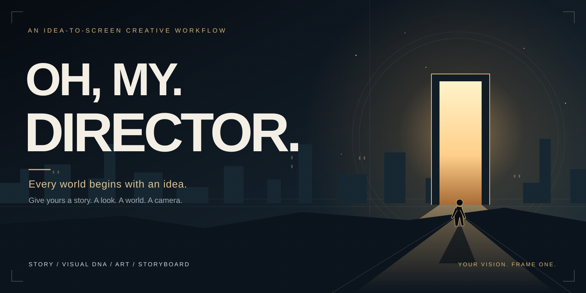
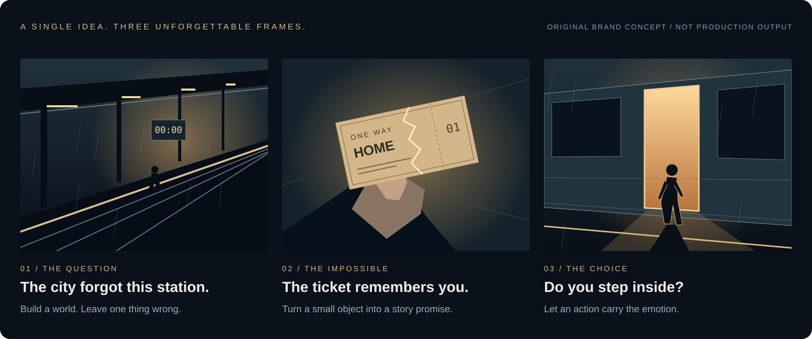
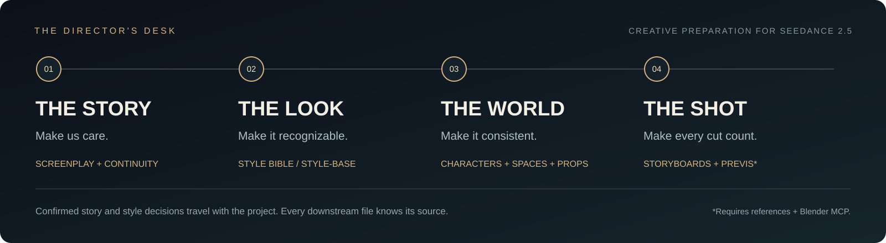

<div align="center">



# oh-my-director

### 从一个念头，一键生成一部完整的电影级漫剧。

你负责那个忘不掉的念头。让故事、人物、世界与镜头，沿着同一条创作线生长。

**[立即开拍](#start) · [进入故事](#opening) · [认识你的剧组](#crew) · [制作指南](docs/workflow.md)**

<sub>中文剧作 · 真人电影质感 · 四阶段接力 · 文件化交付</sub>

</div>

---

**一个念头，不该止步于一个提示词。**

也许是一句“要是呢”，一个反复做的梦，或者一个你始终舍不得忘记的人。**oh-my-director** 把这样的起点，接成一条有故事、有视觉、有连续性、有镜头调度的创作路径。

> **现在能做到什么：** 当前版本提供「剧本 → 视觉 DNA → 美术资产 → 分镜与白膜预演」四个协作技能。“一键成剧”是产品愿景；现阶段仍保留必要的创作确认，图片生成与白膜依赖外部工具，正式视频生成、配音、配乐与最终剪辑尚需另行完成。

<a id="opening"></a>

## 先别看说明书。想象这一幕。

> 午夜，一座废弃车站，只为失去至亲的人亮灯。  
> 女孩握着一张没有日期的车票，听见广播里传来母亲的声音。  
> **“这一次，别上车。”**



<sub>原创品牌概念图，用于展示叙事与视觉意图；不是工作流生成的实拍图、正式资产或成片效果证明。</sub>

| 让观众停下来 | 让世界立得住 | 让下一镜有必要 |
| --- | --- | --- |
| 废弃站台为什么还在报站？ | 同一张车票、同一座站台，始终保留可辨认的视觉锚点。 | 从空站台，到车票，再到门前的选择：每次切镜都带来新信息。 |

一个念头，开始有了戏。接下来，让它拥有一整套制作依据。

**[走进《末班来信》：看一个故事种子怎样交给四个工位 →](examples/last-train.md)**

<a id="crew"></a>

## 四个工位。一条不掉线的创作链。



| 工位 | 它替你解决什么 | 交到下一站的东西 |
| --- | --- | --- |
| **01 · 漫剧编剧**<br>[manga-screenwriter](manga-screenwriter/SKILL.md) | 谁值得被关注？冲突如何升级？最后如何兑现开场的承诺？ | 项目定位、全剧结构、分集大纲、正式正文、连续性状态与审核记录。 |
| **02 · 视觉 DNA**<br>[ai-series-visual-dna](ai-series-visual-dna/SKILL.md) | 为什么换了人物与场景，观众仍相信这是同一个世界？ | 精确版本的 `STYLE-BASE`，以及明确的风格确认。 |
| **03 · 美术总监**<br>[ai-series-art-director](ai-series-art-director/SKILL.md) | 人物不换脸，道具不变样，空间关系有据可查。 | `approved` 资产索引，角色、群众、场景与重要道具的图版提示词和基础设定。 |
| **04 · 分镜导演**<br>[ai-series-storyboard-master](ai-series-storyboard-master/SKILL.md) | 摄影机为什么在这里？这一切，能否被看懂、被执行？ | 单场计划、英文分镜、原文对白绑定；条件齐备时交付独立白膜视频与工程。 |

```text
manga-screenwriter
        ↓
ai-series-visual-dna
        ↓
ai-series-art-director
        ↓
ai-series-storyboard-master
```

已有合适的剧本，可以从视觉 DNA 进入。已经确认的有效材料不必重做；后续每一站都读取同一项目中的精确版本。

## 电影感，不只是好看的单帧。

**先让人物有事可做。** 用目标、行动与后果建立情绪。不是给每一镜贴上“震撼”，而是让观众真正关心门后的答案。

**再让世界记得自己。** 视觉风格有母版，人物与道具有资产，镜头有来源。修改某个角色时，能找到哪些场次需要跟着变化。

**最后让创作可以接着走。** 正式交付写入文件；设定、未来计划与已发生事实分开维护。下次回来，先读项目记录，而不是从聊天记忆里猜进度。

<a id="start"></a>

## 你的第一声「开拍」

### 1. 把四个工位装进 Codex

从本页 **Code → Download ZIP** 下载并解压仓库，进入仓库根目录。使用 Python 3.9+ 运行：

```bash
python scripts/install.py
```

安装器将四个完整技能复制到 `~/.agents/skills`，**不会覆盖已有同名技能**。需要预览路径、使用项目级目录或接续旧安装，见[安装与上手](docs/quick-start.md)。

### 2. 给它一个念头

在可读写本地项目文件的 Codex 环境中发送：

```text
使用 $manga-screenwriter 开始一个新项目《末班来信》。

故事种子：午夜，一座废弃车站只为失去至亲的人亮灯。
女孩想找回母亲，却在列车进站时听见母亲说：“这一次，别上车。”

目标：真人电影质感的中文漫剧。
项目目录：./projects/末班来信
请先完成项目定位、世界观与主要人物，保存项目记录和状态仓。
按技能的阶段流程推进，在需要我确认的节点停下。
```

### 3. 让故事走到镜头前

先确认故事方向，再逐步完成结构、大纲与正文；进入视觉开发时，明确采用真人电影质感，交接有效剧本材料。不要把一句“继续”当作所有阶段的通行证。

**[打开完整上手指南 →](docs/quick-start.md)**

## 离开聊天窗口，创作仍然在。

你逐步获得的是一套可接续、可追溯的制作材料，而不只是一段长回复：

```text
你的项目/
├── 项目记录.md                 # 当前进度、有效版本与下一步
├── 状态仓.md                   # 人物、知情、关系、伏笔与连续性
├── 01-项目定位.md
├── 02-全剧结构.md
├── 03-分集大纲/
├── 04-剧本正文/
├── 05-批次附录/
├── 06-审核/
├── 07-下游交接/
├── DNA/                        # 全剧风格母版
├── ART/                        # 连续性资产库
└── STORYBOARD/                 # 单场计划与片段分镜
    └── EPxxx/SCxxx/PREVIS/      # 条件齐备后交付的白膜预演
```

<sub>这是逐阶段形成的目录示意，不会在开场预建一套空成果。已有合理项目布局可以沿用。</sub>

## 开拍前，你可能还想知道

<details>
<summary><strong>“一键”现在指什么？能直接拿到完整成片吗？</strong></summary>

现在可以用一条命令安装四个技能，用自然语言启动项目，再按阶段推进。仓库还不是无人值守的端到端成片引擎，也没有名为 `$oh-my-director` 的总控技能。正式成片仍需要视频生成、声音与剪辑环节。“完整电影级漫剧”是整条产品路径的目标，不是当前版本的自动交付承诺。

</details>

<details>
<summary><strong>漫剧一定是动画画风吗？</strong></summary>

这里的编剧入口面向中文漫剧叙事；本仓库的视觉 DNA 与美术链路采用真人电影质感，可承载符合题材的电影视效。动画项目需要兼容的动画视觉与资产流程，不能只换一个画风词就强行接入。

</details>

<details>
<summary><strong>已经有小说、大纲或剧本，还要从头开始吗？</strong></summary>

不用。编剧技能可以接续和修订已有项目；合适的故事材料也可以直接交给视觉 DNA。先核对材料、范围、版本与确认状态；片段材料按草案覆盖处理，不冒充完整全剧。

</details>

<details>
<summary><strong>图片、白膜与正式视频分别需要什么？</strong></summary>

图片仅在明确要求时生成，需要可用的图像工具。新白膜需要相关资产参考图、真实 Blender MCP 执行及媒体检查条件。正式视频生成另行接入；分镜的叙事片段规格不等于某个平台的单次提交能力。详见[交付、依赖与边界](docs/workflow.md)。

</details>

---

<div align="center">

### 不是每个人都有一个剧组。<br>但每个人，都可能有一个值得开拍的念头。

**oh-my-director** · 你的故事，从这里有了镜头。

[开始创作](#start) · [阅读制作指南](docs/workflow.md) · [查看故事示例](examples/last-train.md)

</div>
